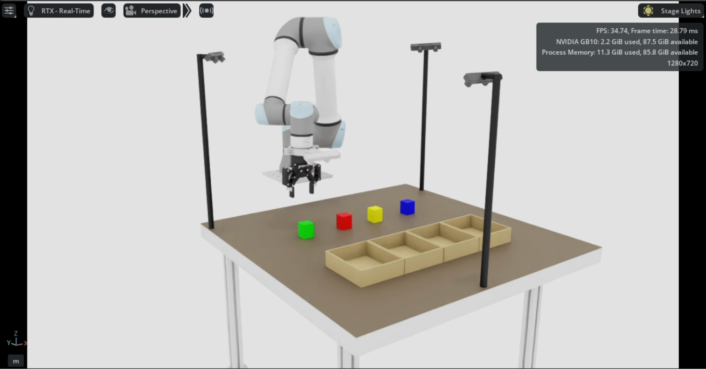

# Nvidia-Isaac-Sim-Env 🦾

**The real UR5e, mirrored in silicon.** This is the digital-twin counterpart
to [`UR-Control/UR5e-2f-85`](https://github.com/ciccio42/UR5e-2f-85): the
same UR5e + Robotiq 2F-85 + 4-camera table, imported into **NVIDIA Isaac
Sim 5.1** and driven over ROS 2 (Jazzy), running on an **NVIDIA DGX Spark
(GB10)**. Same URDF, same joints, same colored-cube pick-place scene — just
rendered in RTX instead of standing in a lab.

<p align="center">
  <a href="media/video-isaac-sim.mp4">
    
  </a>
  <br/>
  <sub>▶️ Click to play <code>media/video-isaac-sim.mp4</code> — the imported digital twin, live in Isaac Sim on the DGX Spark.</sub>
</p>

## 1. Repo structure

```
Nvidia-Isaac-Sim-Env/
├── docker/
│   ├── isaac_sim.dockerfile          # base Isaac Sim 5.1 + ROS2 Jazzy (py3.11) image
│   ├── isaac_sim_ur5e.dockerfile     # ^ extended with the UR5e+Robotiq+table description, prebuilt/flattened URDFs
│   ├── ur_ros2.dockerfile            # standalone UR-only ROS2 image (ur_description, etc.)
│   ├── generate_ur5e_2f_85_urdf.sh   # regenerates both flattened URDFs (ROS + Isaac package://->file:// variant)
│   ├── patch_isaac_robotiq.py        # fixes the Robotiq mimic-joint import issue (finite limits + referenceJoint)
│   ├── isaac_scene_config_server.py  # ROS2 node: places/validates the 4 colored cubes from a scene-config request
│   ├── exts/seedo.scene_config/      # Isaac Sim extension wrapping the scene-config server above
│   ├── isaac_sim_entrypoint.sh / entrypoint.sh
│   └── build_ws/                     # prebuilt ROS2 workspace baked into the Isaac image (see IsaacSim-ros_workspaces)
├── robot/UR5e-2f-85/                 # synced copy of UR-Control/UR5e-2f-85 (source of truth lives in that repo)
├── usd/                              # persistent Omniverse stages (imported robot, tutorials, ROS pub test)
├── IsaacSim-ros_workspaces/           # NVIDIA's ROS2 workspace builder for the Isaac Sim ROS2 bridge (humble_ws/jazzy_ws)
├── IsaacLab/                         # Isaac Lab (RL/learning framework on top of Isaac Sim), for future policy training
├── docs/
│   ├── isaac_sim_ur5e_robotiq_setup.md   # full import/validation log: meshes, mimic-joint fixes, articulation tests
│   └── todo.md
├── media/video-isaac-sim.mp4         # the demo above
├── Digital_Twin_UR5e.md              # two-container recipe: ROS description <-> live Isaac Sim sync
└── README.md
```

`robot/UR5e-2f-85` and `usd/ur5e_2f_85` are the bridge between the two
repos: the ROS 2 description is authored once in `UR-Control/UR5e-2f-85`
and kept in sync here as the Docker build context for
`isaac_sim_ur5e.dockerfile`.

## 2. Installation

**a. Pull the official Isaac Sim image** — follow NVIDIA's [container setup
guide](https://docs.isaacsim.omniverse.nvidia.com/5.1.0/installation/install_container.html#isaac-sim-setup-local-gui-container),
then sanity-check it:
```bash
xhost +local:
docker run --name isaac-sim --entrypoint bash -it --user root --gpus all \
    -e "ACCEPT_EULA=Y" --rm --network=host -e "PRIVACY_CONSENT=Y" \
    -v $HOME/.Xauthority:/isaac-sim/.Xauthority -e DISPLAY \
    -v ~/docker/isaac-sim/cache/main:/isaac-sim/.cache:rw \
    -v ~/docker/isaac-sim/cache/computecache:/isaac-sim/.nv/ComputeCache:rw \
    -v ~/docker/isaac-sim/logs:/isaac-sim/.nvidia-omniverse/logs:rw \
    -v ~/docker/isaac-sim/config:/isaac-sim/.nvidia-omniverse/config:rw \
    -v ~/docker/isaac-sim/data:/isaac-sim/.local/share/ov/data:rw \
    -v ~/docker/isaac-sim/pkg:/isaac-sim/.local/share/ov/pkg:rw \
    -v $(pwd)/usd:/isaac-sim/usd \
    nvcr.io/nvidia/isaac-sim:5.1.0
./isaac-sim.sh --allow-root
```

**b. Build the ROS 2 Jazzy workspace** used by the bridge:
```bash
git clone git@github.com:ciccio42/IsaacSim-ros_workspaces.git
cd IsaacSim-ros_workspaces && git submodule update --init --recursive
./build_ros.sh -d jazzy -v 24.04
mv build_ws ../docker
```

**c. Build the custom Isaac Sim image** (ROS2 Jazzy/py3.11 + UR5e + Robotiq
+ platform assets baked in):
```bash
docker build -t isaac-sim-custom:5.1.0 -f docker/isaac_sim.dockerfile .
```

**d. Build the UR5e digital-twin image** on top of it (adds the
description package, pre-generates both flattened URDFs — see
`docs/isaac_sim_ur5e_robotiq_setup.md` for exactly what this fixes):
```bash
docker build -t isaac-sim-ur5e:5.1.0 -f docker/isaac_sim_ur5e.dockerfile .
```
Keep `robot/UR5e-2f-85` in sync with `UR-Control/UR5e-2f-85` first (it's the
build context for this image), and build the `ur_robotiq_teleoperation`
image from that repo per its `docs/teleoperation.md`.

## 3. Usage

The digital twin runs as **two containers** on the same `--net=host` /
`ROS_DOMAIN_ID`, matching the real pipeline
(`AIControllerNode -> moveit_controller -> MoveIt 2 -> ros2_control -> Isaac Sim`
— see `docs/isaac_sim_ur5e_robotiq_setup.md`'s architecture diagram):

**Terminal 1 — robot description / state publisher:**
```bash
export UR5e_2f_85_PATH=/home/asus-mivia/Desktop/UR-Control/UR5e-2f-85
docker run -it --rm --net=host --ipc=host -e ROS_DOMAIN_ID=0 --gpus all --privileged \
  -e DISPLAY=$DISPLAY -e NVIDIA_VISIBLE_DEVICES=all -e NVIDIA_DRIVER_CAPABILITIES=all \
  -v /tmp/.X11-unix:/tmp/.X11-unix:rw \
  -v ${UR5e_2f_85_PATH}/ur5e_2f_85:/home/ros2_ws/src/ur5e_2f_85 \
  -v ${UR5e_2f_85_PATH}/dataset_collector:/home/ros2_ws/src/dataset_collector \
  -v ${UR5e_2f_85_PATH}/moveit_controller:/home/ros2_ws/src/moveit_controller \
  --name ur5e_digital_twin_rsp ur_robotiq_teleoperation

ros2 launch ur5e_2f_85_description ur5e_2f_85_display.launch.py &
```

**Terminal 2 — Isaac Sim** (`RMW_IMPLEMENTATION` must match Terminal 1's —
see the networking note below):
```bash
docker run --name isaac-sim-ur5e -it --rm --net=host --ipc=host --gpus all \
  -e "ACCEPT_EULA=Y" -e ROS_DOMAIN_ID=0 -e RMW_IMPLEMENTATION=rmw_fastrtps_cpp -e "PRIVACY_CONSENT=Y" \
  -v $HOME/.Xauthority:/isaac-sim/.Xauthority -e DISPLAY \
  -v $(pwd)/usd:/isaac-sim/usd \
  isaac-sim-ur5e:5.1.0

generate_ur5e_2f_85_urdf   # only if the description package changed
/isaac-sim/isaac-sim.sh --allow-root \
    --enable isaacsim.asset.importer.urdf --enable isaacsim.asset.exporter.urdf \
    --enable isaacsim.ros2.urdf --enable isaacsim.ros2.bridge
```
Then in Isaac Sim: **File > Import** →
`/workspace/isaac_assets/ur5e_2f_85/ur5e_2f_85_platform_isaac.urdf`
(*Static Base* ON), and run `docker/patch_isaac_robotiq.py` once after
import / before the first Physics ▶ to fix the Robotiq mimic-joint limits.

With the ROS2 bridge enabled, `/joint_states` published from Terminal 1
drives the imported articulation live via an Action Graph
(`ROS2 Subscribe JointState -> Articulation Controller`) — move a slider in
`joint_state_publisher_gui` and watch the twin follow.

> ⚠️ **Networking**: both containers need the *same* `RMW_IMPLEMENTATION`
> (Isaac defaults to `rmw_cyclonedds_cpp`, the UR image to `rmw_fastrtps_cpp`)
> or `/robot_description`/`/joint_states` won't cross the bridge.

**Scene setup** for pick-place evaluation: the `seedo.scene_config` Isaac
extension (`docker/isaac_scene_config_server.py`) listens on
`/seedo/configure_scene_request` and places/validates the four colored
cubes (red/green/yellow/blue) on the table — the same objects seen in the
demo video above, matching the real-robot task in `UR-Control/UR5e-2f-85`.

## 4. Where things stand

Per `docs/isaac_sim_ur5e_robotiq_setup.md` and `docs/todo.md`: the UR5e's 6
joints and the Robotiq's mimic-joint gripper are both fully validated
(open/close/reset) in Isaac. Still open: making the Robotiq patch
reproducible as a persistent USD, wiring `/isaac_joint_states` <->
`/isaac_joint_commands` through `topic_based_ros2_control`, camera/RGB-D
integration, and a full MoveIt-driven pick-place run inside Isaac.

## Docs

- [Digital_Twin_UR5e.md](Digital_Twin_UR5e.md) — the two-container recipe above, in full
- [docs/isaac_sim_ur5e_robotiq_setup.md](docs/isaac_sim_ur5e_robotiq_setup.md) — import validation log + every mesh/mimic-joint fix
- [docs/todo.md](docs/todo.md)
- [Isaac Sim robot setup tutorials](https://docs.isaacsim.omniverse.nvidia.com/5.1.0/robot_setup_tutorials/index.html#isaac-sim-robot-setup-tutorials)
- [Isaac Sim quickstart / demos](https://docs.isaacsim.omniverse.nvidia.com/5.1.0/introduction/quickstart_index.html#isaac-sim-intro-quickstart-series)
